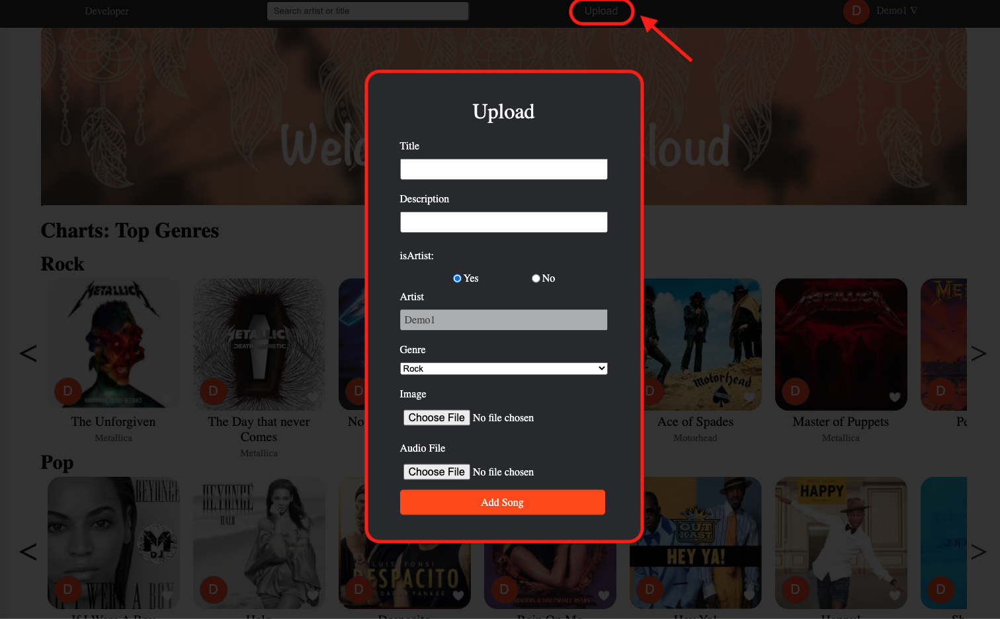

<!-- PROJECT SHIELDS -->
<!--
*** I'm using markdown "reference style" links for readability.
*** Reference links are enclosed in brackets [ ] instead of parentheses ( ).
*** See the bottom of this document for the declaration of the reference variables
*** for contributors-url, forks-url, etc. This is an optional, concise syntax you may use.
*** https://www.markdownguide.org/basic-syntax/#reference-style-links
-->


<!-- PROJECT LOGO -->
<br />
<p align="center">
  <a href="https://sinecloud.herokuapp.com">
    
  </a>

  <h3 align="center">SineCloud</h3>

  <p align="center">
    SineCloud is a clone of SoundCloud with a twist. SineCloud lets people discover and enjoy the greatest selection of music from the most diverse creator community on earth.
    <br />
    <a href="https://github.com/ycherradi/sinecloud/wiki"><strong>Explore the docs »</strong></a>
    <br />
    <br />
    <a href="https://sinecloud.herokuapp.com">View Site</a>
    ·
    <a href="https://github.com/ycherradi/sinecloud/issues">Report Bug</a>
    ·
    <a href="https://github.com/ycherradi/sinecloud/issues">Request Feature</a>
  </p>
</p>


<!-- TABLE OF CONTENTS -->
<details open="open">
  <summary><h2 style="display: inline-block">Table of Contents</h2></summary>
  <ol>
    <li>
      <a href="#about-the-project">About The Project</a>
      <ul>
        <li><a href="#built-with">Built With</a></li>
      </ul>
    </li>
    <li>
      <a href="#getting-started">Getting Started</a>
      <ul>
        <li><a href="#prerequisites">Prerequisites</a></li>
        <li><a href="#installation">Installation</a></li>
      </ul>
    </li>
    <li><a href="#usage">Usage</a></li>
    <li><a href="#roadmap">Roadmap</a></li>
    <li><a href="#contributing">Contributing</a></li>
    <li><a href="#license">License</a></li>
    <li><a href="#contact">Contact</a></li>
    <li><a href="#acknowledgements">Acknowledgements</a></li>
  </ol>
</details>


<!-- ABOUT THE PROJECT -->
## About The Project

[Click here to view SineCloud live on the web!](https://sinecloud.herokuapp.com)
<br>
</br>


## Overall Structure

### Back End
The app was built using Flask, SQLAlchemy, and Python on the back end with a PostgreSQL database. The backend structure is RESTful API. Model associations are used to minimize database queries to the backend, assuring speed and reliability.

### Front End
The front end is built with React and Javascript while utilizing Redux architecture, producing a lightning-fast user interface and calling upon dynamically rendered components.

### Built With

* [React](https://reactjs.org/)
* [JavaScript](https://www.javascript.com/)
* [Python](https://docs.python.org/3/)
* [Redux](https://redux.js.org/)
* [Flask](https://flask.palletsprojects.com/en/1.1.x/)
* [SQLAlchemy](https://flask-sqlalchemy.palletsprojects.com/en/2.x/)
* [PostgreSQL](https://www.postgresql.org/docs/current/)
* [Wavesurfer](https://wavesurfer-js.org/docs/)
* [CSS](http://www.css3.info/)

<!-- GETTING STARTED -->
## Getting Started

To get a local copy up and running follow these simple steps.

### Prerequisites

Here is everything we need you to do to get started with Discordanc3.

### Installation

1. Clone this repository (only this branch)

   ```bash
   git clone https://github.com/ycherradi/sinecloud.git
   ```

2. Install dependencies

      ```bash
      pipenv install --dev -r dev-requirements.txt && pipenv install -r requirements.txt
      ```

3. Create a **.env** file based on the example with proper settings for your
   development environment
4. Setup your PostgreSQL user, password and database and make sure it matches your **.env** file

5. Get into your pipenv, migrate your database, seed your database, and run your flask app

   ```bash
   pipenv shell
   ```

   ```bash
   flask db upgrade
   ```

   ```bash
   flask seed all
   ```

   ```bash
   flask run
   ```

6. To run the React App in development, checkout the [README](./react-app/README.md) inside the `react-app` directory.


<!-- USAGE EXAMPLES -->
## Usage
### An easy-to-use login with a pre-configured Demo User.

### Search by title or artist.

### Play songs.

### Upload new song.

### song Page and artist Page.

### Like songs and follow artists.

### Progress through songs by clicking either on the song waveform or the player's waveform.

### Access you profile section.

### Edit Profile image and artist name.


## Obstacles

### Wavesurfers.js
SineCloud utilizes Wavesurfers.js to keep a render audio waverforms.

### AWS
SineCloud utilizes AWS to allow users to upload server and profile images.

<!-- ROADMAP -->
## Roadmap

See the [Project Wiki](https://github.com/ycherradi/sinecloud/wiki) for more details about SineCloud.

<!-- CONTRIBUTING -->
## Contributing

Contributions are what make the open source community such an amazing place to be learn, inspire, and create. Any contributions you make are **greatly appreciated**.

1. Fork the Project
2. Create your Feature Branch (`git checkout -b feature/AmazingFeature`)
3. Commit your Changes (`git commit -m 'Add some AmazingFeature'`)
4. Push to the Branch (`git push origin feature/AmazingFeature`)
5. Open a Pull Request


<!-- CONTACT -->
## Contact & Acknowledgements


* Yassine Cherradi - [LinkedIn](https://www.linkedin.com/in/yassine-cherradi-035784101/) - [GitHub](https://github.com/ycherradi) - [Personal Site](https://ycherradi.github.io/)


Project Link: [https://github.com/nkuek/discordance](https://github.com/ycherradi/sinecloud)

<!-- ACKNOWLEDGEMENTS -->

<!-- test -->
